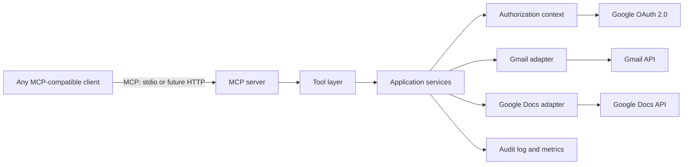
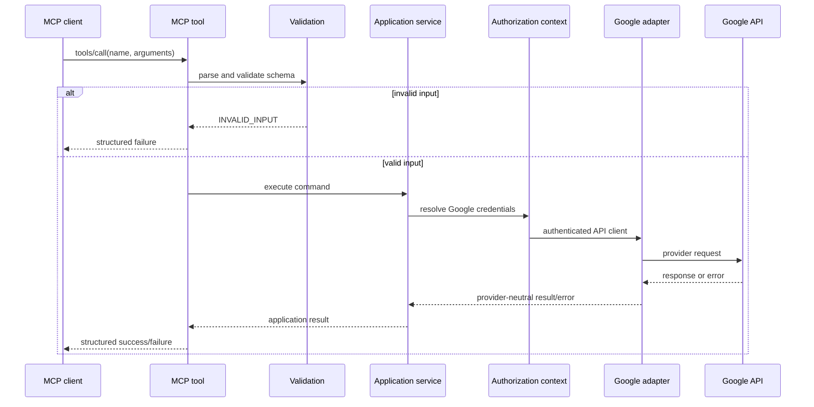

# Architecture: Generic Google Workspace MCP Server

## 1. Purpose

This document defines the architecture for a reusable Model Context Protocol (MCP) server that lets any MCP-compatible client create Gmail drafts, send Gmail messages, and append text to existing Google Docs.

The MCP contract is the stable public interface. Google OAuth, Gmail API requests, Google Docs batch updates, token storage, logging, and retry decisions remain implementation details behind server-owned boundaries.

## 2. Technology Choices

| Concern | Choice | Rationale |
| --- | --- | --- |
| Runtime | Node.js 22 LTS | Supported, deployable locally or as a service, and well supported by MCP tooling. |
| Language | TypeScript with strict mode | Provides stable, validated service contracts. |
| MCP SDK | `@modelcontextprotocol/sdk` | Implements the standard MCP server and transport abstractions. |
| Google client | `googleapis` | Official Google API client for OAuth 2.0, Gmail, and Docs. |
| Validation | `zod` | Defines runtime validation and MCP-compatible JSON schemas from one source. |
| Logging | `pino` | Structured logging with configurable redaction. |
| Tests | Vitest | Fast unit and integration tests with straightforward mocking. |

The initial transport is standard input/output (stdio), which is appropriate for local MCP clients. The server core must be transport-independent so a future Streamable HTTP deployment can reuse its tool and service layers.

## 3. System Context



The MCP client identity and the authorized Google identity are separate:

- The MCP transport authenticates or identifies the client when the selected transport supports it.
- The authorization context resolves the Google user whose credentials may be used.
- A trusted client does not implicitly grant access to any Google account.

For local development, a `single-user` authorization-context resolver can load one securely stored credential set. Production deployments must resolve a Google user from a server-side mapping associated with the authenticated MCP client or session.

## 4. Module Layout

```text
src/
  index.ts                         # Process bootstrap and selected transport
  config/
    config.ts                      # Environment parsing and configuration validation
  server/
    createServer.ts                # MCP server composition
    transports/stdio.ts            # Stdio transport adapter
  mcp/
    toolRegistry.ts                # Registers all public MCP tools
    tools/
      gmailCreateDraft.ts
      gmailSendEmail.ts
      googleDocsAppendContent.ts
    responses.ts                   # Success/error MCP response mapping
  application/
    gmailService.ts                # Draft and send use cases
    googleDocsService.ts           # Append use case
    authorizationContext.ts        # Resolves Google credentials per request
  providers/google/
    oauthClientFactory.ts
    gmailAdapter.ts
    docsAdapter.ts
    messageBuilder.ts              # RFC 2822 MIME construction
    googleErrorMapper.ts
  auth/
    oauthService.ts                # Start/callback/refresh OAuth lifecycle
    tokenStore.ts                  # Token store interface
    encryptedTokenStore.ts         # Production implementation
    localTokenStore.ts             # Local-development implementation only
  validation/
    email.ts
    schemas.ts
  errors/
    applicationError.ts
  observability/
    logger.ts
    auditLogger.ts
    metrics.ts
  middleware/
    rateLimiter.ts
    requestContext.ts
tests/
  unit/
  integration/
  mcp/
```

Tool modules only parse input, declare side effects in their descriptions, invoke an application service, and translate the result to the MCP response shape. They must not make direct Google API calls.

## 5. Public MCP Contract

All tools return JSON content with a common envelope. Expected failures are returned as structured tool results rather than unhandled process errors.

```ts
type ToolSuccess<T> = { success: true } & T;

type ToolFailure = {
  success: false;
  error: {
    code: ErrorCode;
    message: string;
    retryable: boolean;
    providerStatus?: number;
  };
};
```

`providerStatus` is optional and included only when it is safe to disclose. Raw provider responses, access tokens, refresh tokens, message content, and OAuth client secrets are never returned.

### `gmail_create_draft`

Description: Creates a Gmail draft for the authenticated Google user. This operation creates a draft only and never sends email.

```json
{
  "to": ["recipient@example.com"],
  "cc": ["optional@example.com"],
  "bcc": ["optional@example.com"],
  "subject": "Draft subject",
  "body": "Draft email body",
  "isHtml": false,
  "idempotencyKey": "optional-client-operation-id"
}
```

Returns `draftId`, `messageId`, and `threadId` on success.

### `gmail_send_email`

Description: Sends an email externally through Gmail for the authenticated Google user. This operation has an immediate external side effect.

Its input matches `gmail_create_draft`; on success it returns `messageId` and `threadId`.

### `google_docs_append_content`

Description: Appends text to the end of an existing Google Document for the authenticated Google user. It preserves existing content and has a document-modifying side effect.

```json
{
  "documentId": "google-document-id",
  "content": "Content to append",
  "addNewline": true,
  "idempotencyKey": "optional-client-operation-id"
}
```

Returns `documentId` and `appendedCharacters` on success. The public tool uses camelCase field names consistently, even if an internal provider library uses a different naming convention.

## 6. Request Flow



The document append adapter first calls `documents.get` to determine the final `endIndex` of the last body structural element. It then calls `documents.batchUpdate` with one `insertText` request at `endIndex - 1`, preserving Google Docs' terminal newline, and prefixes content with a newline only when `addNewline` is true. The adapter must not use delete or replace requests.

The Gmail adapter builds an RFC 2822 MIME message with `To`, optional `Cc` and `Bcc`, `Subject`, and either `text/plain` or sanitized `text/html` content. It base64url encodes the MIME message before calling either `users.drafts.create` or `users.messages.send`. The draft use case has no execution path to `users.messages.send`.

## 7. Validation and Limits

Zod schemas validate all tool arguments before authorization or provider calls.

| Field | Rule |
| --- | --- |
| `to` | Required non-empty array of syntactically valid email addresses. |
| `cc`, `bcc` | Optional arrays; every value is validated. |
| `subject` | Required non-empty string, bounded by `MAX_EMAIL_SUBJECT_SIZE`. |
| `body` | Required non-blank string, bounded by `MAX_EMAIL_BODY_SIZE`. |
| `isHtml` | Boolean, default `false`. HTML is sanitized before message construction. |
| `documentId` | Required trimmed ID matching an allowlisted identifier format and bounded length. |
| `content` | Required non-blank string, bounded by `MAX_DOCUMENT_APPEND_SIZE`. |
| `addNewline` | Boolean, default `true`. |
| `idempotencyKey` | Optional bounded printable identifier. |

Validation neither normalizes recipient addresses nor silently removes invalid values. It reports each invalid field as `INVALID_INPUT`.

## 8. OAuth and Credential Design

Required scopes are deliberately narrow:

| Scope | Purpose |
| --- | --- |
| `https://www.googleapis.com/auth/gmail.compose` | Create drafts and send messages. |
| `https://www.googleapis.com/auth/documents` | Read the document end position and append content. |

`gmail.send` is not requested because `gmail.compose` is required for draft creation and also permits sending. Scope changes require explicit user re-consent.

OAuth authorization-code flow is hosted outside the MCP tool-call path:

1. The user begins authorization through an authenticated server endpoint or local CLI command.
2. The auth service creates a high-entropy `state` value, stores it with expiration, and redirects to Google.
3. The callback verifies and consumes the state before exchanging the code.
4. The auth service stores encrypted credentials associated with the Google identity and authorization-context key.
5. On a tool call, the authorization-context resolver loads credentials and refreshes expired access tokens using the Google client library.

The local token store is permitted only with restrictive filesystem permissions and must be rejected when `NODE_ENV=production`. Production uses a secret manager or encrypted database implementation of `TokenStore`; encryption keys are managed outside application configuration.

If no valid authorization context exists, return `AUTHENTICATION_REQUIRED` with a non-sensitive action such as “Authorize a Google account before invoking this tool.”

## 9. Errors, Retry, and Idempotency

Application errors use these stable codes:

```text
INVALID_INPUT
AUTHENTICATION_REQUIRED
AUTHORIZATION_DENIED
RESOURCE_NOT_FOUND
RATE_LIMITED
PROVIDER_ERROR
NETWORK_ERROR
TIMEOUT
CONFLICT
INTERNAL_ERROR
```

The Google error mapper translates status codes and known provider reasons to these codes without leaking raw responses. For example, 401 maps to `AUTHENTICATION_REQUIRED`, 403 to `AUTHORIZATION_DENIED`, 404 to `RESOURCE_NOT_FOUND`, and 429 to `RATE_LIMITED`.

Only safe, clearly transient operations are retried within the provider adapter, using bounded exponential backoff with jitter and a request timeout. Side-effecting Gmail sends and Docs appends are never automatically retried after a provider request may have reached Google.

An optional idempotency key is scoped to the authorization context and tool name. The idempotency store records a request fingerprint and terminal response. A repeated key with the same fingerprint returns the stored result; a repeated key with different input returns `CONFLICT`. Initial local mode may use an in-memory store, while production uses a shared store with a configurable retention period.

## 10. Security and Observability

- Enforce HTTPS/TLS for remote transports and OAuth callbacks.
- Apply configurable per-client and per-authorization-context rate limits before provider calls.
- Redact `authorization`, tokens, client secrets, email bodies, document content, and raw provider payloads from logs.
- Emit an audit event for every write attempt with request ID, tool name, privacy-safe user/client identifiers, outcome, error code, latency, and provider operation ID where available.
- Record counters for tool calls, successes, failures, auth failures, rate limits, provider failures, and latency histograms by tool.
- Do not log recipient lists by default; an approved privacy policy can enable a hashed recipient count or domain-only metadata.

## 11. Configuration

Configuration is parsed once at startup and validation failures stop the server before it accepts MCP requests.

```text
GOOGLE_CLIENT_ID=
GOOGLE_CLIENT_SECRET=
GOOGLE_REDIRECT_URI=
GOOGLE_TOKEN_STORE=local|secret-manager|database
TOKEN_ENCRYPTION_KEY_REFERENCE=
LOG_LEVEL=info
MAX_EMAIL_SUBJECT_SIZE=998
MAX_EMAIL_BODY_SIZE=1048576
MAX_DOCUMENT_APPEND_SIZE=1048576
REQUEST_TIMEOUT_MS=15000
RATE_LIMIT_PER_MINUTE=30
IDEMPOTENCY_TTL_SECONDS=86400
```

`.env.example` contains keys and safe placeholders only. Runtime configuration and deployment secrets must never be committed.

## 12. Testing Strategy

| Test level | Coverage |
| --- | --- |
| Unit | Input schemas, email validation, MIME construction, HTML sanitization, Google error mapping, configuration parsing, idempotency decisions, and tool descriptions. |
| Adapter integration | Mocked Google clients verifying `drafts.create`, `messages.send`, and Docs `get` plus `batchUpdate` calls and error translation. |
| MCP contract | An MCP client connects over stdio, discovers all three tools, inspects schemas, invokes success paths with fake services, and receives structured failures. |
| OAuth integration | Test credentials or controlled mocks cover authorization state validation and automatic token refresh. |
| Manual smoke | An independently configured MCP client uses a consented test account to create a draft, send a test message, and append to a test document. |

No integration test uses production OAuth credentials, real user mailboxes, or live documents outside a dedicated test environment.

## 13. Deployment Evolution

The same composition root supports two deployment modes:

- **Local:** stdio transport, single-user authorization resolver, local encrypted token storage, and a localhost OAuth callback.
- **Production:** Streamable HTTP transport behind TLS, authenticated MCP clients, multi-user authorization resolver, shared encrypted token store, durable idempotency/rate-limit stores, centralized logs, and metrics export.

Future Workspace capabilities add a provider adapter, application service, schema, and tool registration. Existing tool contracts remain unchanged. No future adapter may bypass authorization context resolution, validation, error mapping, audit logging, or idempotency policy.

## 14. Delivery Sequence

1. Initialize the TypeScript project, linting, tests, configuration parser, logger, and stdio MCP bootstrap.
2. Define common result/error types, validation schemas, request context, and tool registry tests.
3. Implement OAuth state handling, token-store interface, local secure store, and authorization-context resolver.
4. Implement Gmail MIME builder and adapter, then expose and test draft creation before adding send.
5. Implement and test Gmail send with idempotency protection and audit events.
6. Implement the Docs append adapter and tool, verifying insertion at the final body index.
7. Add rate limiting, metrics, production token-store implementation, Streamable HTTP transport, and deployment documentation.

This order keeps every external side effect behind tested validation, authorization, and observability boundaries before it is exposed through MCP.